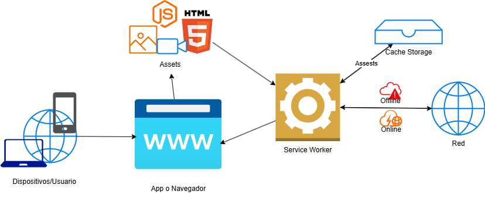

# Diagrama Arquitctura PWA

Este documento describe la arquitectura base de las aplicaciones PWA en la que esta basada este proyecto, donde se evidencia el manejo del Service worker como el corazon principal del sistema el cual gestiona la cache del sistema estando pendiente de la conexion a internet para decidir de donde tomar los assets

A continuación se muestra el diagrama de arquitextura pwa:

