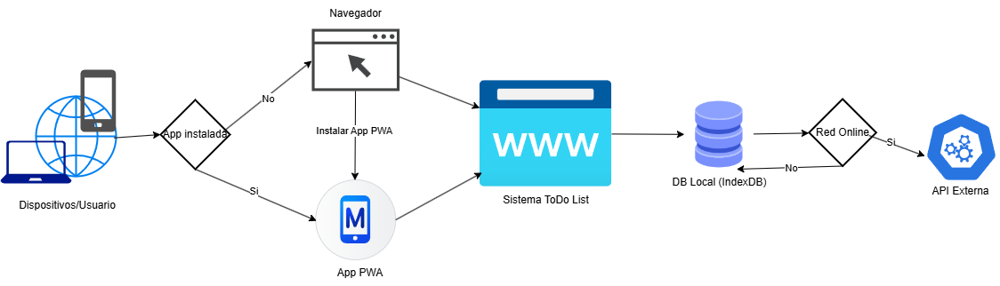

# Flujo funcional de la Aplicación To Do List PWA

Este documento describe la funcionalidad de la aplicacion, detallando los componentes clave y sus interacciones. El siguiente diagrama ilustra el flujo general y la estructura de la solución, que integra Angular como PWA, manejo de IndexedDB para la persistencia local y sincronización con una API externa.

A continuación se muestra el diagrama de funcionalidad:

